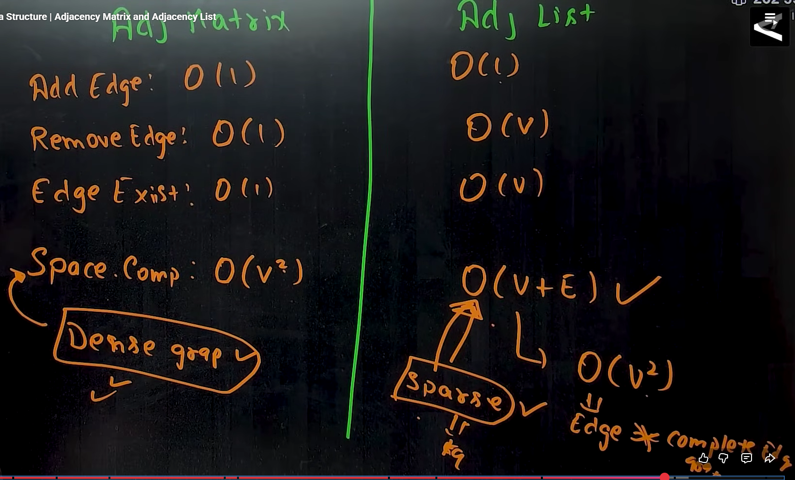
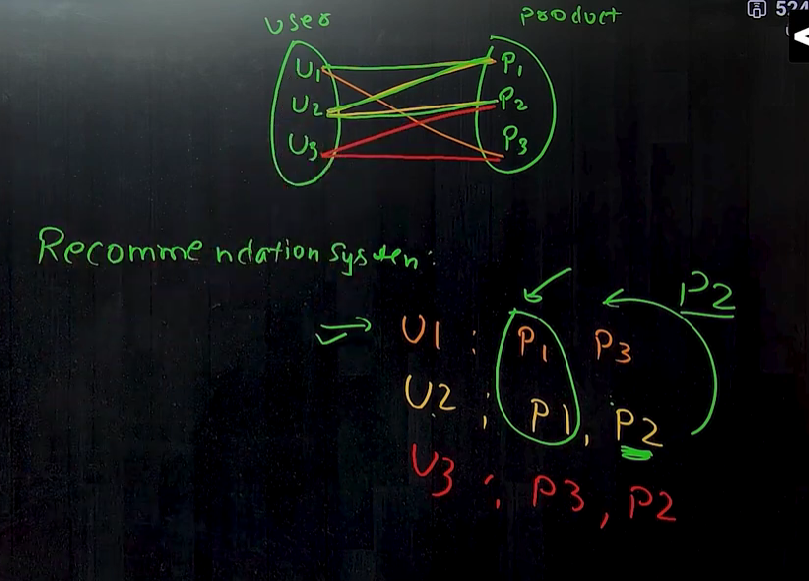
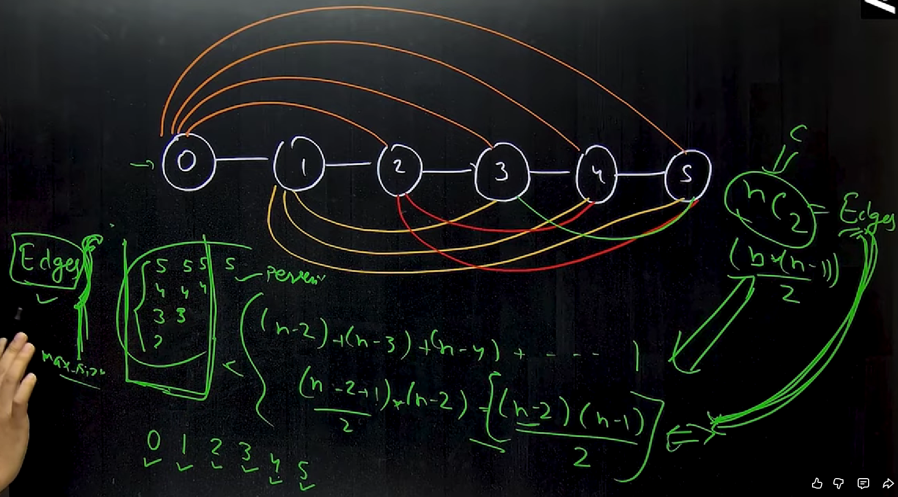

# 🌳 **Graph & Tree Notes**

---

## 🔁 **DFS and BFS**

- **DFS (Depth First Search)** → uses a **stack**, like **pre-order traversal** in a tree.
- **BFS (Breadth First Search)** → uses a **queue**, like **level-order traversal** in a tree.

---

## ⚡ **Articulation Point**

> An **articulation point** is a node in a graph which, if removed, breaks the graph into **two or more components**.  
> Think of it as a **single point of failure** in a system or network.

To avoid this, we use **bi-connected components** — effectively adding an **extra edge** so there are two different routes even if the articulation point is removed.

---

## 🔄 **Backtracking & Branch and Bound**

- **Backtracking (DFS)**
- **Branch and Bound (BFS)**
- **State space tree**
- **Bounding function** (mostly used in BFS)

Backtracking uses a **state-space diagram** (a tree-like structure) and is handy when we need **all possible ways** of something.

---

## 🎨 **M-Coloring Problems**

- **M-coloring decision problem**  
  Decide whether **3** (or **4**) colors are enough to color the graph so that **no adjacent nodes** share the same color.

- **M-coloring optimization problem**  
  Find the **minimum number of colors** required to color the graph with the same constraint.

---

## 🔁 **Hamiltonian Cycle**

A **Hamiltonian cycle** is a cycle in a graph where you **visit every node once** and **return to the starting node**.

> If the graph has an **articulation point** or a **pendant node** (child node), then a **Hamiltonian cycle is not possible**.

---

# 🕸️ **GRAPH**

### **Types of Graphs**

- **Directed**, **Undirected** graph
- **Cyclic** (even one cycle makes the whole graph cyclic), **Acyclic** graph
- **Directed cyclic** graph, **Directed acyclic graph (DAG)**
- **Connected** and **Disconnected** graph
  - In a **directed** graph, you might not be able to go in the reverse direction, which can make it **disconnected**.
- **Complete** graph — every node is connected to all other nodes
- **Weighted**, **Unweighted** graph

---

## BFS (Breadth First Search) Traversal

### Intuition

**BFS is like spreading a virus 🦠**  
One node spreads to all its neighbors, then those neighbors spread to their neighbors, and so on — **level by level**.

---

### Why We Use a Queue for BFS

- BFS follows **First In, First Out (FIFO)**.

### Steps

1. Start from a node and mark it as visited.
2. Add the node to the **queue**.
3. Remove the **front element** from the queue.
4. Visit all its **unvisited adjacent nodes**.
5. Add those adjacent nodes to the **end of the queue**.
6. Repeat until the **queue is empty**.

### Key Property

- BFS explores nodes **level by level**.
- It is commonly used to find the **shortest path in an unweighted graph**.

### Application of BFS

1. Shortest Path in an
2. unweighted graph
3. Cycle Detection
4. Crawlers in Search Engine
5. Social Networking Search
6. In Garbage Collection
7. Broadcasting

### Sample Question

1. BFS of Graph (Solved soln in folder)

---

### **Graph Representation**

**Two common ways TO REPRESENT GRAPH:**

1. **Adjacency Matrix**  
   Used when the graph is **dense** (close to complete).
   - **Time Complexity:** `O(V^2)`
   - **Space Complexity:** `O(V^2)`
   - Drawback: Uses extra space to represent **no edge** (e.g., storing `0`).

2. **Adjacency List**  
   Used when the graph is **sparse**.
   - **Time Complexity:** `O(V + E)`
   - **Space Complexity:** `O(V + E)`
   - In the **worst case** (complete graph), TC and SC approach `O(V^2)`.

### Question

1. BFS Traversal in Graph
2. DFS Traversal in Graph
3. Cycle detection in Graph using BFS/DFS

---

## Cycle Detection in an Undirected Graph

There are two methods to solve this: **DFS** and **BFS**.

### Logic

The main idea is:  
If a node gets **visited again** at any point during DFS/BFS, we might think there’s a cycle.

But in an **undirected graph**, this can trick us.

Example: if we only have two nodes **0 ↔ 1**, then:

- from 0 we go to 1
- from 1 we can go back to 0 (because it’s undirected)

So it _looks_ like we visited a node twice, but that’s **not a real cycle**.

That’s why we add one condition:  
✅ **Ignore the edge back to the parent node.**

#### --> In DFS, 3 cases can happen

When you're at a node and checking one of its neighbors:

1. **The neighbor is the parent**  
   → ignore it (skip checking cycle for this edge)

2. **The neighbor is already visited (and not the parent)**  
   → declare **cycle present**

3. **The neighbor is not visited yet**  
   → visit that node and repeat the same process

---

## Topological sorting

## 1. Using DFS

Usecase: Where lets say process A has to be done beofre process B and process c has to be done bofre process B etc (like wirting html brofre csss and wirting css/html beofre writing JS)

You only do **topological sorting** in a **DAG (Directed Acyclic Graph)**, because:

- If the graph is **not directed**, you don’t have a clear “who comes before whom” direction.
- If the graph is **cyclic**, you get stuck in a dead loop.

Topological sorting means: if we have a directed graph, we want to sort the nodes into a single line (an order) showing **who comes before whom**.

For example, you might have rules like:

- **A should come before B**
- **B should come before C and D**

So one valid topological order could be: **A → C → D → B** (the idea is just to represent the order in one line).

That’s why we need:

- a **directed** graph (to know who comes before whom), and
- an **acyclic** graph (because if it’s cyclic, we are stuck in a loop like:  
  **A comes before B, B comes before C, but C comes before A**, which is impossible to satisfy).

A simple way to think about solving topological sorting is this line:

> **“A particular node will only go into the stack when all the nodes it depends on are already in the stack.”**

And yes, we use a **stack** here because it’s one of the easiest ways to handle the ordering in these cases.

## 2. Using BFS - Kahn’s Algorithm

kahn's can only be applied using BFS

--> (BFS method for Topological Sorting)

This is the **second way** to do topological sorting: using **BFS with Kahn’s Algorithm**.

### Core idea

We keep finding nodes that have **no parents** (meaning: **no incoming edges**).  
We add those nodes to the answer, then “remove” them from the graph, and repeat.

To do this properly, we need to understand one key term:

- **Indegree** = number of **incoming edges** (how many parents a node has)
- **Outdegree** = number of **outgoing edges** (how many children it points to)

---

### Step 1: Compute indegree for every node

The easy way is:

- Look at the **adjacency list**
- For every edge `u -> v`, increment `indegree[v]` by 1

So indegree is basically:  
✅ “How many times this node is reachable as a _neighbor_ from others.”

---

### Step 2: Push all indegree = 0 nodes into a queue

Since this is BFS, we use a **QUEUE**.

- Put every node whose **indegree is 0** into the queue
- These are the nodes with no parents, so they can safely come first

---

### Step 3: BFS process

While the queue is not empty:

1. Pop the front node `u`
2. Add `u` to the **answer**
3. For every neighbor `v` of `u`:
   - Decrease `indegree[v]` by 1 (because we are “removing” the edge `u -> v`)
   - If `indegree[v]` becomes 0, push `v` into the queue

---

### Why this works

Each time a node’s indegree becomes 0, it means:
✅ all of its parents have already been placed in the answer  
so it’s now safe to place it next.

---

### Extra note (important)

If at the end, the answer does **not** include all nodes, that means:
❌ the graph had a **cycle**, so topological sorting is not possible.

---

## Cycle Detection in a **Directed** Graph (Only Directed)

Example (real-life style):  
Resource 1 is waiting for Resource 2, Resource 2 is waiting for Resource 3, and Resource 3 is waiting for Resource 1.  
That creates a **directed cycle**: **1 → 2 → 3 → 1**.

---

## Why the undirected logic doesn’t work here

In an **undirected graph**, we said:

> “If a neighbor is already visited and it’s not the parent, then cycle exists.”

That rule is **not valid for directed graphs**, because direction matters.

In a directed graph, you might reach a node that was visited before, but that **doesn’t always mean a cycle**.  
It could be a cross-edge pointing to a node that was already fully processed, and that’s fine.

So we need a new rule.

---

## Correct logic for directed graphs (DFS Stack / Path)

In a directed graph, a cycle exists if:

✅ **A node appears more than once in the same DFS path.**

That means: if during DFS, you find an edge to a node that is **already in the current recursion stack**, then cycle is present.

This “current recursion stack” is called:

- **PATH**, or
- **DFS Stack**, or
- **Recursion Stack**

### Key idea

- When you go deeper in DFS, mark the node as `inPath = true`
- When you backtrack (return), set `inPath = false`  
  (this is what you meant by “remove the 1 from the visited array once we trace back”)

---

## Optimized version (2 arrays)

To make it faster, we usually keep **two arrays**:

1. **visited[]**  
   → means “this node is completely processed already”

2. **inPath[]** (or `dfsStack[]`)  
   → means “this node is currently in the DFS path”

### Flow:

When DFS reaches a node `u`:

1. If `inPath[u] == true`  
   → ✅ cycle found (because u appeared again in the same path)

2. Else if `visited[u] == true`  
   → skip it (we already checked this node’s paths before, no need to repeat)

3. Else
   - mark `visited[u] = true`
   - mark `inPath[u] = true`
   - DFS all neighbors
   - after done, mark `inPath[u] = false` (backtracking step)

This extra `visited[]` improves time complexity because you don’t re-check finished parts of the graph again.

---

## Another way (Kahn’s Algorithm / Topological Sort trick)

We know:
✅ Topological sorting works only for **DAG**.

So if we run **Kahn’s Algorithm (BFS topological sort)** on a directed graph:

- If the graph is a DAG → we will output **all nodes**
- If the graph has a cycle → we will output **fewer nodes than total**

Why fewer?  
Because nodes inside the cycle never reach **in-degree = 0**, so they never enter the QUEUE.

So:
✅ **If result size < number of nodes THEN the cycle EXISTS**

---

## Bipartite Graph (Simple Idea) — 2-Coloring Algorithm

A **bipartite graph** is a graph where you can split all nodes into **two groups** such that:
✅ every edge connects a node from Group 1 to a node from Group 2  
(and **no edge** connects two nodes inside the same group)

The easiest way to check bipartite is using the **2-coloring algorithm**.

---

## Key finding (Cycles rule)

- If the graph contains an **odd-length cycle**, then ❌ it is **NOT bipartite**
- If all cycles are **even-length** (or there are no cycles), then ✅ it **CAN be bipartite**

Reason (simple):  
In an odd cycle, when you alternate colors around the cycle, you eventually get forced to give the same color to two connected nodes.

---

## BFS-based 2-Coloring (most common)

We mostly use **BFS** for this.

### Setup

- Keep a `color[]` array:
  - `-1` = not colored yet
  - `0` and `1` = the two colors (two sets)

### Algorithm

For every node (because the graph might be disconnected):

1. If the node is not colored, assign it a color (say `0`) and push it into the queue.
2. While queue is not empty:
   - pop a node `u`
   - for every neighbor `v`:
     - if `v` is not colored → color it with the opposite color: `1 - color[u]`, and push to queue
     - else if `color[v] == color[u]` → ❌ conflict → graph is **not bipartite**

If BFS finishes without conflict, ✅ the graph is bipartite.

---

### Note

This is basically the same BFS “level-by-level” logic:

- nodes at alternating levels get alternating colors
- odd cycle breaks that rule and causes a color clash

USE case:

---

Exmaple Graph question are

1. Numebr of Island
2. Covid spread (the hostipal one where 2 -> already covid, 1-> normal pateint, 0->no one in the room) / Similar question Rotten Oranges
3. Replace 0's with X's and rules was 0 should be surrounded by X from all side and tehen you return the result 2D array

---

# Shortest Path (Beginner Notes)

- In **shortest path** questions, we often use **BFS** when the graph is **unweighted** (or all edges have the same cost).
- We usually **avoid DFS** for shortest path because DFS may go deep down a long route first, exploring lots of unnecessary nodes before finding the best answer.

### When BFS works well

- **Undirected / Directed unweighted graph** (each edge cost is the same, usually treated as `1`)
- **BFS guarantees the shortest path** (fewest edges) because it explores in **layers** (distance `0`, then `1`, then `2`, ...).

### When BFS does NOT work

- **Weighted graphs** (edges have different costs)
- BFS explores by **number of edges**, not by **total weight**.
- So BFS might reach a node using a **heavier** path first, mark it visited, and then **block** a later path that is **cheaper** (lower total weight) but uses more edges.

### What to use instead for weighted graphs

- **Dijkstra’s Algorithm**: for graphs with **non-negative** edge weights
  - Key idea: always expand the node with the **smallest known distance** next (using a priority queue).
  - Instead of a simple `visited`, you keep a `dist[]` array:
    - If you find a cheaper way to reach a node, update `dist[node]` and continue.
- **Bellman–Ford**: if the graph can have **negative** edge weights (slower, but handles negatives).

### About “DFS for weighted shortest path”

- You can try DFS, but you must avoid repeating too much work. That usually means:
  - Track the **current total cost** along the path, and
  - Only continue exploring from a node if the current cost is **smaller** than the best cost you’ve seen for that node so far.
- This idea is basically moving toward what Dijkstra does (but Dijkstra is the standard, efficient solution).

### KIND if problems solved

- Undirected graph not weigthed
- Undirected Cyclic groah - weighted
- Directed Ayalcis Graph DAG - topo sorted

## Dijkstra's Algorith - Undirected cyclic weighted grpah TC - O(v^2) SC - O(v) (Can be applied in directed and undirected graph)

In simple terms: for each vertex, check every outgoing edge. Take the current distance to that node + the edge weight; if that total is smaller than the distance stored at the neighbor (which may be ∞ at first), update/replace it. To avoid extra work and cycles, keep an explored/visited array and skip vertices that are already visited.

1. Select the vertex which is not explored yet
   and it's dist is minum among all the
   unexplored vertexes.

2. Relax the edges.
   ↳ Look at your all the unexplored neighbours
   ↳ if ( dist[node] + weight < dist[neighbour] )
   dist[neighbour] = dist[node] + weight;

### Another thing to remember is

### Implementation choices for Dijkstra (Array vs Min-Heap / Priority Queue)

In Dijkstra’s algorithm, we must **repeatedly pick the unexplored vertex with the smallest distance**.  
If we do this using a simple **array**, each “find-min” step can be expensive, because we may need to scan all unexplored vertices every time.

So, a common improvement is to use a **Min-Heap / Priority Queue** to always get the smallest-distance vertex faster.

#### Trade-offs

**1) Using an Array**

- **Space Complexity (SC):** `O(V)`
- **Time Complexity (TC):** Slower overall because selecting the minimum distance vertex requires scanning.

**2) Using a Min-Heap / Priority Queue**

- **Time Complexity (TC):** Improved, because:
  - `extract-min` and `insert` are faster with a heap.
  - Overall complexity is typically written as `O(E log E)` (often also expressed as `O(E log V)`).
- **Space Complexity (SC):** Increases to about `O(V + E)` because:
  - The priority queue can contain **repeated entries for the same node** (due to multiple relaxations),
  - So the heap size can grow close to the number of edges in the worst case.

✅ **Summary:**  
Using a min-heap speeds up Dijkstra’s algorithm, but it usually uses more memory than the array-based approach.

> **Note (why `log E` or `log V`?):**  
> The `log` comes from heap operations (`push`/`pop`) which take `O(log N)` where `N` is the heap size.
>
> - If your priority queue keeps **at most `V` vertices** (e.g., using _decrease-key_), then `N ≈ V` → `O(E log V)`.
> - If your implementation **allows duplicates** (common in practice: push a new `(dist, node)` instead of decrease-key), the heap can grow to `N ≈ E` → `O(E log E)`.  
>   Also, since `E ≤ V²`, `log E` and `log V` differ only by a small constant factor in many cases (Solve using maths take log on both side s you will eventually left with ElogV).

- Conclusion is that if there is dense graph than we use ARRAY, if we have sparse graph then we use Heap/priority queue
- Drawback is simple it wont work with negative weights

## Shortest Path cannot be foudn in grpah which has negative cycle boz in that case you will keep on roaming and eveyr time you will get smaller route.

Negative cycle means in a cycle the weight of the cycle added together is negative

# Bellman - ford algorithm Only works will directed Graph

- Can help you with negative weights
- Can help you detect negative cycle as well
- BUT can only be used in directed graph

# Bellman–Ford Algorithm — Concise Notes

## Purpose

- Computes **single-source shortest paths** in a weighted graph.
- Works even if some edges have **negative weights**.
- Detects **negative-weight cycles** (reachable from the source).

---

## Key Terms

### Relaxation - baiscally if you find an even cheaper route update it

For an edge \( (u \rightarrow v) \) with weight \( w(u,v) \):

- If  
  \[
  dist[u] + w(u,v) < dist[v]
  \]
  then update  
  \[
  dist[v] \leftarrow dist[u] + w(u,v)
  \]

This update is called **relaxing the edge**.

---

## Steps / Rules (Bellman–Ford)

### Step 1: Relax all edges \(V - 1\) times

- Let \(V\) = number of vertices.
- Repeat **\(V - 1\)** rounds:
  - For **every edge** \( (u \rightarrow v) \), apply the relaxation rule.

**Why \(V - 1\) times?**

- Any shortest path (without cycles) can have at most **\(V - 1\)** edges.

---

### Step 2: Relax all edges one more time (cycle detection)

- Do **one additional pass** over all edges:
  - If **any distance value changes**, then a **negative-weight cycle exists** (reachable from the source).
  - If **no distance changes**, then the distances are the **shortest paths from the source**.

---

## Decision Summary

- **Change in Step 2** → **Negative-weight cycle present**
- **No change in Step 2** → **Shortest paths found**

it works for negative weights

Dijkstra - uses Vertex for algorithm
Bellamon ford - uses Edeg for algorithm

Shortest Path is not possible in Undirected Negative grpah as there will be an negative cycle present

Last 10 min is worth watching - https://www.youtube.com/watch?v=6DCnv6Q3iwk&t=1494s

## Floyd Warshall algorithm - used on directed, postive or negative both, and to find mutlti source shortest distance - ALSO DIAGONAL ELEMNT WILL MMOSTLY BE ZERO, IF IT IS NEGATIVE THEN NEGATIVE CYCLE IS PRESENT

## Main Purpose

- Computes **all-pairs shortest paths**: shortest distance from **every node to every other node**
  - e.g., \(1 \to 2\), \(1 \to 3\), \(2 \to 5\), etc., for all pairs.

---

## Weight / Graph Notes

- Works with **positive and negative edge weights**.
- Commonly used on **directed graphs** as well as undirected graphs (it works for both).
- Not valid for shortest paths if a **negative-weight cycle** exists (distances become undefined).

---

## Core Idea (Intermediate Vertex Method)

- Repeatedly improve distances by allowing paths that go through an intermediate node.
- Each vertex becomes the **intermediate** once.

For vertices \(i, j, k\):

- Check whether going from \(i\) to \(j\) via \(k\) is shorter:
  \[
  dist[i][j] \leftarrow \min\big(dist[i][j],\; dist[i][k] + dist[k][j]\big)
  \]

---

## Steps / Rules (Floyd–Warshall)

1. **Initialize distance matrix `dist`**
   - `dist[i][j]` = edge weight from \(i\) to \(j\) if edge exists, else \(+\infty\)
   - `dist[i][i] = 0` for all \(i\)

2. **Run intermediate-node loops**
   - For each node \(k\) (as the intermediate)
     - For every pair \((i, j)\), update:
       \[
       dist[i][j] = \min(dist[i][j],\; dist[i][k] + dist[k][j])
       \]
   - Intuition:
     - First allow paths that use node 1 as intermediate, then node 2, then node 3, etc.

---

## Detecting Negative Cycles

- After running the algorithm:
  - If **any diagonal entry becomes negative**, i.e.,
    \[
    dist[i][i] < 0
    \]
    then the graph contains a **negative-weight cycle** (reachable from \(i\)).
- If a negative cycle exists, **shortest paths are not well-defined** for affected vertices.

---

## Complexity

- **Time Complexity:** \(O(V^3)\)
- **Space Complexity:** \(O(V^2)\) for the distance matrix
  - Updates are often done **in-place** on the same matrix, but the matrix itself still requires \(V^2\) space.

## Time-complexity comparison (bullet-style, not a table)

### Dijkstra’s Algorithm (single-source)

- **Sparse graph:** \(O((V+E)\log V) \approx O(E\log V)\)
- **Dense graph (array / matrix style):** \(O(V^2)\)
- **All-pairs via repeating Dijkstra:** \(O\big(V \cdot (V+E)\log V\big)\)
  - If \(E=\Theta(V^2)\): becomes \(O(V^3 \log V)\)

### Bellman–Ford (single-source)

- **General:** \(O(VE)\)
  - If \(E=\Theta(V^2)\) (dense): becomes \(O(V^3)\)
- **All-pairs via repeating Bellman–Ford:** \(O(V^2E)\)
  - If \(E=\Theta(V^2)\): becomes \(O(V^4)\)

### Floyd–Warshall (all-pairs)

marshall - did the work on Transitive law
floy did teh work on adding and update teh weight on the edges

- **Always:** \(O(V^3)\)
- Does **all-pairs shortest paths in one run**, which is why it can outperform “repeat single-source” approaches on dense graphs.

---

## Practical thumb rule

- **Need single-source shortest paths + negative edges or cycle detection?** → Bellman–Ford
- **Need single-source shortest paths + nonnegative edges, graph is sparse?** → Dijkstra
- **Need all-pairs shortest paths, especially on dense graphs?** → Floyd–Warshall

# 🌲 **TREE**

- For a tree with **n nodes**, there are **n−1 edges**; **no loops**.
- There is always a **root**, and each child has **one parent** only.
- **Every tree is a graph**, but **not every graph is a tree**.
