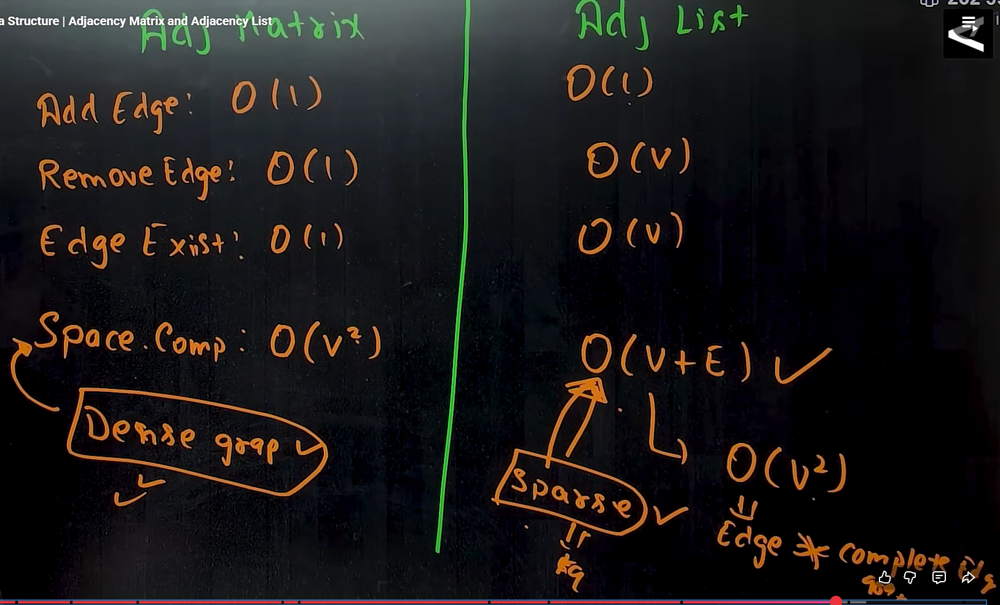
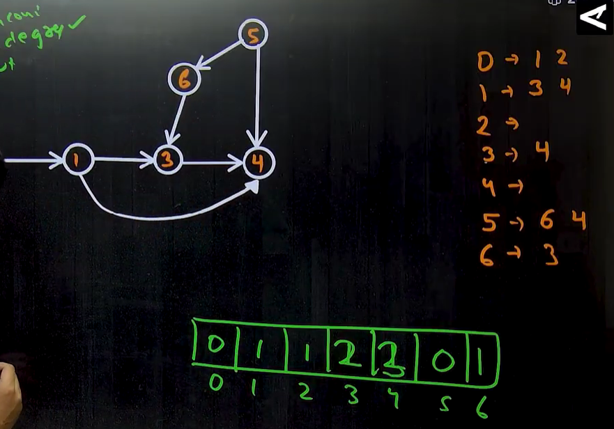
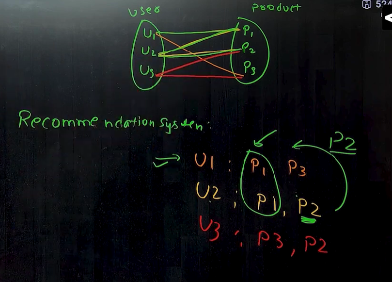
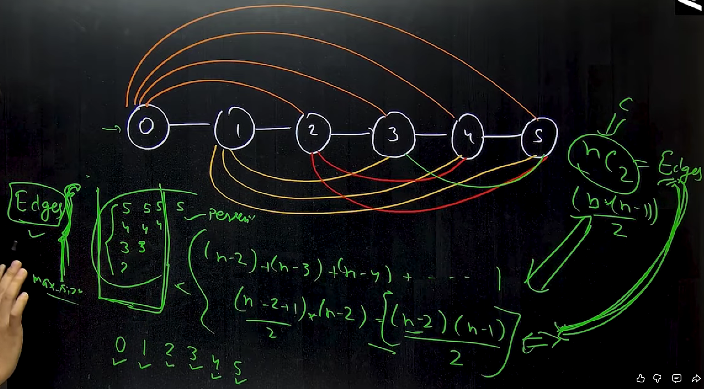

# 🌳 **Graph & Tree Notes**

---

## 🔁 **DFS and BFS**

- **DFS (Depth First Search)** → uses a **stack**, like **pre-order traversal** in a tree.
- **BFS (Breadth First Search)** → uses a **queue**, like **level-order traversal** in a tree.

---

## ⚡ **Articulation Point**

> An **articulation point** is a node in a graph which, if removed, breaks the graph into **two or more components**.  
> Think of it as a **single point of failure** in a system or network.

To avoid this, we use **bi-connected components** — effectively adding an **extra edge** so there are two different routes even if the articulation point is removed.

---

## 🔄 **Backtracking & Branch and Bound**

- **Backtracking (DFS)**
- **Branch and Bound (BFS)**
- **State space tree**
- **Bounding function** (mostly used in BFS)

Backtracking uses a **state-space diagram** (a tree-like structure) and is handy when we need **all possible ways** of something.

---

## 🎨 **M-Coloring Problems**

- **M-coloring decision problem**  
  Decide whether **3** (or **4**) colors are enough to color the graph so that **no adjacent nodes** share the same color.

- **M-coloring optimization problem**  
  Find the **minimum number of colors** required to color the graph with the same constraint.

---

## 🔁 **Hamiltonian Cycle**

A **Hamiltonian cycle** is a cycle in a graph where you **visit every node once** and **return to the starting node**.

## Graph Paths and Cycles

- **Hamiltonian Path**: Visits each vertex exactly once; doesn't have to return to the start.

- **Hamiltonian Cycle**: Visits each vertex exactly once and returns to the starting point.

- **Eulerian Path**: Uses each edge exactly once; doesn't have to visit every vertex.

- **Eulerian Cycle**: Uses each edge exactly once and returns to the starting point.

---

## Examples

### 1. Every Eulerian Circuit is **not** necessarily a Hamiltonian Cycle

Imagine a graph with 5 nodes arranged so that you can visit all 5 nodes once, forming a Hamiltonian cycle. However, while doing this you might have to travel over some edges more than once.  
This breaks the Eulerian rule of using **each edge exactly once**, so it would **not** be an Eulerian circuit.

### 2. Every Eulerian Cycle is **not** necessarily a Hamiltonian Cycle

Imagine a graph where you visit **all edges exactly once** (Eulerian cycle), but there is a **separate node disconnected** from the main structure.

In that case:

- You covered all edges → satisfies Eulerian cycle.
- But you **missed one vertex** → not a Hamiltonian cycle.

---

## Complexity

- **Hamiltonian Cycle Problem**: Determining whether a Hamiltonian cycle exists is **NP-complete**, and brute-force solutions can take **O(n!) (factorial time)**. AHHHHHHHHH :)

- **Eulerian Cycle Check**: Much more efficient. It can be determined by checking the **degree of vertices** (all vertices must have even degree for a cycle).

> If the graph has an **articulation point** or a **pendant node** (child node), then a **Hamiltonian cycle is not possible**.

---

# 🕸️ **GRAPH**

### **Types of Graphs**

- **Directed**, **Undirected** graph
- **Cyclic** (even one cycle makes the whole graph cyclic), **Acyclic** graph
- **Directed cyclic** graph, **Directed acyclic graph (DAG)**
- **Connected** and **Disconnected** graph
  - In a **directed** graph, you might not be able to go in the reverse direction, which can make it **disconnected**.
- **Complete** graph — every node is connected to all other nodes
- **Weighted**, **Unweighted** graph

---

## BFS (Breadth First Search) Traversal

### Intuition

**BFS is like spreading a virus 🦠**  
One node spreads to all its neighbors, then those neighbors spread to their neighbors, and so on — **level by level**.

---

### Why We Use a Queue for BFS

- BFS follows **First In, First Out (FIFO)**.

### Steps

1. Start from a node and mark it as visited.
2. Add the node to the **queue**.
3. Remove the **front element** from the queue.
4. Visit all its **unvisited adjacent nodes**.
5. Add those adjacent nodes to the **end of the queue**.
6. Repeat until the **queue is empty**.

### Key Property

- BFS explores nodes **level by level**.
- It is commonly used to find the **shortest path in an unweighted graph**.

### Application of BFS

1. Shortest Path in an
2. unweighted graph
3. Cycle Detection
4. Crawlers in Search Engine
5. Social Networking Search
6. In Garbage Collection
7. Broadcasting

### Sample Question

1. BFS of Graph (Solved soln in folder)

---

### **Graph Representation**

**Two common ways TO REPRESENT GRAPH:**

1. **Adjacency Matrix**  
   Used when the graph is **dense** (close to complete).
   - **Time Complexity:** `O(V^2)`
   - **Space Complexity:** `O(V^2)`
   - Drawback: Uses extra space to represent **no edge** (e.g., storing `0`).

2. **Adjacency List**  
   Used when the graph is **sparse**.
   - **Time Complexity:** `O(V + E)`
   - **Space Complexity:** `O(V + E)`
   - In the **worst case** (complete graph), TC and SC approach `O(V^2)`.



### Question

1. BFS Traversal in Graph
2. DFS Traversal in Graph
3. Cycle detection in Graph using BFS/DFS

---

## Cycle Detection in an Undirected Graph

There are two methods to solve this: **DFS** and **BFS**.

### Logic

The main idea is:  
If a node gets **visited again** at any point during DFS/BFS, we might think there’s a cycle.

But in an **undirected graph**, this can trick us.

Example: if we only have two nodes **0 ↔ 1**, then:

- from 0 we go to 1
- from 1 we can go back to 0 (because it’s undirected)

So it _looks_ like we visited a node twice, but that’s **not a real cycle**.

That’s why we add one condition:  
✅ **Ignore the edge back to the parent node.**

#### --> In DFS, 3 cases can happen

When you're at a node and checking one of its neighbors:

1. **The neighbor is the parent**  
   → ignore it (skip checking cycle for this edge)

2. **The neighbor is already visited (and not the parent)**  
   → declare **cycle present**

3. **The neighbor is not visited yet**  
   → visit that node and repeat the same process

---

## Topological sorting

## 1. Using DFS

Usecase: Where lets say process A has to be done beofre process B and process c has to be done bofre process B etc (like wirting html brofre csss and wirting css/html beofre writing JS)

You only do **topological sorting** in a **DAG (Directed Acyclic Graph)**, because:

- If the graph is **not directed**, you don’t have a clear “who comes before whom” direction.
- If the graph is **cyclic**, you get stuck in a dead loop.

Topological sorting means: if we have a directed graph, we want to sort the nodes into a single line (an order) showing **who comes before whom**.

For example, you might have rules like:

- **A should come before B**
- **B should come before C and D**

So one valid topological order could be: **A → C → D → B** (the idea is just to represent the order in one line).

That’s why we need:

- a **directed** graph (to know who comes before whom), and
- an **acyclic** graph (because if it’s cyclic, we are stuck in a loop like:  
  **A comes before B, B comes before C, but C comes before A**, which is impossible to satisfy).

A simple way to think about solving topological sorting is this line:

> **“A particular node will only go into the stack when all the nodes it depends on are already in the stack.”**

And yes, we use a **stack** here because it’s one of the easiest ways to handle the ordering in these cases.

## 2. Using BFS - Kahn’s Algorithm

kahn's can only be applied using BFS

--> (BFS method for Topological Sorting)

This is the **second way** to do topological sorting: using **BFS with Kahn’s Algorithm**.

### Core idea

We keep finding nodes that have **no parents** (meaning: **no incoming edges**).  
We add those nodes to the answer, then “remove” them from the graph, and repeat.

To do this properly, we need to understand one key term:

- **Indegree** = number of **incoming edges** (how many parents a node has)
- **Outdegree** = number of **outgoing edges** (how many children it points to)

---

### Step 1: Compute indegree for every node

The easy way is:

- Look at the **adjacency list**
- For every edge `u -> v`, increment `indegree[v]` by 1

So indegree is basically:  
✅ “How many times this node is reachable as a _neighbor_ from others.”

---

### Step 2: Push all indegree = 0 nodes into a queue

Since this is BFS, we use a **QUEUE**.

- Put every node whose **indegree is 0** into the queue
- These are the nodes with no parents, so they can safely come first

---

### Step 3: BFS process

While the queue is not empty:

1. Pop the front node `u`
2. Add `u` to the **answer**
3. For every neighbor `v` of `u`:
   - Decrease `indegree[v]` by 1 (because we are “removing” the edge `u -> v`)
   - If `indegree[v]` becomes 0, push `v` into the queue

---

### Why this works

Each time a node’s indegree becomes 0, it means:
✅ all of its parents have already been placed in the answer  
so it’s now safe to place it next.

---

### Extra note (important)

If at the end, the answer does **not** include all nodes, that means:
❌ the graph had a **cycle**, so topological sorting is not possible.



---

## Cycle Detection in a **Directed** Graph (Only Directed)

Example (real-life style):  
Resource 1 is waiting for Resource 2, Resource 2 is waiting for Resource 3, and Resource 3 is waiting for Resource 1.  
That creates a **directed cycle**: **1 → 2 → 3 → 1**.

---

## Why the undirected logic doesn’t work here

In an **undirected graph**, we said:

> “If a neighbor is already visited and it’s not the parent, then cycle exists.”

That rule is **not valid for directed graphs**, because direction matters.

In a directed graph, you might reach a node that was visited before, but that **doesn’t always mean a cycle**.  
It could be a cross-edge pointing to a node that was already fully processed, and that’s fine.

So we need a new rule.

---

## Correct logic for directed graphs (DFS Stack / Path)

In a directed graph, a cycle exists if:

✅ **A node appears more than once in the same DFS path.**

That means: if during DFS, you find an edge to a node that is **already in the current recursion stack**, then cycle is present.

This “current recursion stack” is called:

- **PATH**, or
- **DFS Stack**, or
- **Recursion Stack**

### Key idea

- When you go deeper in DFS, mark the node as `inPath = true`
- When you backtrack (return), set `inPath = false`  
  (this is what you meant by “remove the 1 from the visited array once we trace back”)

---

## Optimized version (2 arrays)

To make it faster, we usually keep **two arrays**:

1. **visited[]**  
   → means “this node is completely processed already”

2. **inPath[]** (or `dfsStack[]`)  
   → means “this node is currently in the DFS path”

### Flow:

When DFS reaches a node `u`:

1. If `inPath[u] == true`  
   → ✅ cycle found (because u appeared again in the same path)

2. Else if `visited[u] == true`  
   → skip it (we already checked this node’s paths before, no need to repeat)

3. Else
   - mark `visited[u] = true`
   - mark `inPath[u] = true`
   - DFS all neighbors
   - after done, mark `inPath[u] = false` (backtracking step)

This extra `visited[]` improves time complexity because you don’t re-check finished parts of the graph again.

---

## Another way (Kahn’s Algorithm / Topological Sort trick)

We know:
✅ Topological sorting works only for **DAG**.

So if we run **Kahn’s Algorithm (BFS topological sort)** on a directed graph:

- If the graph is a DAG → we will output **all nodes**
- If the graph has a cycle → we will output **fewer nodes than total**

Why fewer?  
Because nodes inside the cycle never reach **in-degree = 0**, so they never enter the QUEUE.

So:
✅ **If result size < number of nodes THEN the cycle EXISTS**

---

## Bipartite Graph (Simple Idea) — 2-Coloring Algorithm

A **bipartite graph** is a graph where you can split all nodes into **two groups** such that:
✅ every edge connects a node from Group 1 to a node from Group 2  
(and **no edge** connects two nodes inside the same group)

The easiest way to check bipartite is using the **2-coloring algorithm**.

---

## Key finding (Cycles rule)

- If the graph contains an **odd-length cycle**, then ❌ it is **NOT bipartite**
- If all cycles are **even-length** (or there are no cycles), then ✅ it **CAN be bipartite**

Reason (simple):  
In an odd cycle, when you alternate colors around the cycle, you eventually get forced to give the same color to two connected nodes.

---

## BFS-based 2-Coloring (most common)

We mostly use **BFS** for this.

### Setup

- Keep a `color[]` array:
  - `-1` = not colored yet
  - `0` and `1` = the two colors (two sets)

### Algorithm

For every node (because the graph might be disconnected):

1. If the node is not colored, assign it a color (say `0`) and push it into the queue.
2. While queue is not empty:
   - pop a node `u`
   - for every neighbor `v`:
     - if `v` is not colored → color it with the opposite color: `1 - color[u]`, and push to queue
     - else if `color[v] == color[u]` → ❌ conflict → graph is **not bipartite**

If BFS finishes without conflict, ✅ the graph is bipartite.

---

### Note

This is basically the same BFS “level-by-level” logic:

- nodes at alternating levels get alternating colors
- odd cycle breaks that rule and causes a color clash

USE case:


---

Exmaple Graph question are

1. Numebr of Island
2. Covid spread (the hostipal one where 2 -> already covid, 1-> normal pateint, 0->no one in the room) / Similar question Rotten Oranges
3. Replace 0's with X's and rules was 0 should be surrounded by X from all side and tehen you return the result 2D array

---

# Shortest Path (Beginner Notes)

- In **shortest path** questions, we often use **BFS** when the graph is **unweighted** (or all edges have the same cost).
- We usually **avoid DFS** for shortest path because DFS may go deep down a long route first, exploring lots of unnecessary nodes before finding the best answer.

### When BFS works well

- **Undirected / Directed unweighted graph** (each edge cost is the same, usually treated as `1`)
- **BFS guarantees the shortest path** (fewest edges) because it explores in **layers** (distance `0`, then `1`, then `2`, ...).

### When BFS does NOT work

- **Weighted graphs** (edges have different costs)
- BFS explores by **number of edges**, not by **total weight**.
- So BFS might reach a node using a **heavier** path first, mark it visited, and then **block** a later path that is **cheaper** (lower total weight) but uses more edges.

### What to use instead for weighted graphs

- **Dijkstra’s Algorithm**: for graphs with **non-negative** edge weights
  - Key idea: always expand the node with the **smallest known distance** next (using a priority queue).
  - Instead of a simple `visited`, you keep a `dist[]` array:
    - If you find a cheaper way to reach a node, update `dist[node]` and continue.
- **Bellman–Ford**: if the graph can have **negative** edge weights (slower, but handles negatives).

### About “DFS for weighted shortest path”

- You can try DFS, but you must avoid repeating too much work. That usually means:
  - Track the **current total cost** along the path, and
  - Only continue exploring from a node if the current cost is **smaller** than the best cost you’ve seen for that node so far.
- This idea is basically moving toward what Dijkstra does (but Dijkstra is the standard, efficient solution).

### KIND if problems solved

- Undirected graph not weigthed
- Undirected Cyclic groah - weighted
- Directed Ayalcis Graph DAG - topo sorted

## Dijkstra's Algorith - Undirected cyclic weighted grpah TC - O(v^2) SC - O(v) (Can be applied in directed and undirected graph)

In simple terms: for each vertex, check every outgoing edge. Take the current distance to that node + the edge weight; if that total is smaller than the distance stored at the neighbor (which may be ∞ at first), update/replace it. To avoid extra work and cycles, keep an explored/visited array and skip vertices that are already visited.

1. Select the vertex which is not explored yet
   and it's dist is minum among all the
   unexplored vertexes.

2. Relax the edges.
   ↳ Look at your all the unexplored neighbours
   ↳ if ( dist[node] + weight < dist[neighbour] )
   dist[neighbour] = dist[node] + weight;

### Another thing to remember is

### Implementation choices for Dijkstra (Array vs Min-Heap / Priority Queue)

In Dijkstra’s algorithm, we must **repeatedly pick the unexplored vertex with the smallest distance**.  
If we do this using a simple **array**, each “find-min” step can be expensive, because we may need to scan all unexplored vertices every time.

So, a common improvement is to use a **Min-Heap / Priority Queue** to always get the smallest-distance vertex faster.

#### Trade-offs

**1) Using an Array**

- **Space Complexity (SC):** `O(V)`
- **Time Complexity (TC):** Slower overall because selecting the minimum distance vertex requires scanning.

**2) Using a Min-Heap / Priority Queue**

- **Time Complexity (TC):** Improved, because:
  - `extract-min` and `insert` are faster with a heap.
  - Overall complexity is typically written as `O(E log E)` (often also expressed as `O(E log V)`).
- **Space Complexity (SC):** Increases to about `O(V + E)` because:
  - The priority queue can contain **repeated entries for the same node** (due to multiple relaxations),
  - So the heap size can grow close to the number of edges in the worst case.

✅ **Summary:**  
Using a min-heap speeds up Dijkstra’s algorithm, but it usually uses more memory than the array-based approach.

> **Note (why `log E` or `log V`?):**  
> The `log` comes from heap operations (`push`/`pop`) which take `O(log N)` where `N` is the heap size.
>
> - If your priority queue keeps **at most `V` vertices** (e.g., using _decrease-key_), then `N ≈ V` → `O(E log V)`.
> - If your implementation **allows duplicates** (common in practice: push a new `(dist, node)` instead of decrease-key), the heap can grow to `N ≈ E` → `O(E log E)`.  
>   Also, since `E ≤ V²`, `log E` and `log V` differ only by a small constant factor in many cases (Solve using maths take log on both side s you will eventually left with ElogV).

- Conclusion is that if there is dense graph than we use ARRAY, if we have sparse graph then we use Heap/priority queue
- Drawback is simple it wont work with negative weights



## Shortest Path cannot be foudn in grpah which has negative cycle boz in that case you will keep on roaming and eveyr time you will get smaller route.

Negative cycle means in a cycle the weight of the cycle added together is negative

# Bellman - ford algorithm Only works will directed Graph

- Can help you with negative weights
- Can help you detect negative cycle as well
- BUT can only be used in directed graph

# Bellman–Ford Algorithm — Concise Notes

## Purpose

- Computes **single-source shortest paths** in a weighted graph.
- Works even if some edges have **negative weights**.
- Detects **negative-weight cycles** (reachable from the source).

---

## Key Terms

### Relaxation - baiscally if you find an even cheaper route update it

For an edge \( (u \rightarrow v) \) with weight \( w(u,v) \):

- If  
  \[
  dist[u] + w(u,v) < dist[v]
  \]
  then update  
  \[
  dist[v] \leftarrow dist[u] + w(u,v)
  \]

This update is called **relaxing the edge**.

---

## Steps / Rules (Bellman–Ford)

### Step 1: Relax all edges \(V - 1\) times

- Let \(V\) = number of vertices.
- Repeat **\(V - 1\)** rounds:
  - For **every edge** \( (u \rightarrow v) \), apply the relaxation rule.

**Why \(V - 1\) times?**

- Any shortest path (without cycles) can have at most **\(V - 1\)** edges.

---

### Step 2: Relax all edges one more time (cycle detection)

- Do **one additional pass** over all edges:
  - If **any distance value changes**, then a **negative-weight cycle exists** (reachable from the source).
  - If **no distance changes**, then the distances are the **shortest paths from the source**.

---

## Decision Summary

- **Change in Step 2** → **Negative-weight cycle present**
- **No change in Step 2** → **Shortest paths found**

it works for negative weights

Dijkstra - uses Vertex for algorithm
Bellamon ford - uses Edeg for algorithm

Shortest Path is not possible in Undirected Negative grpah as there will be an negative cycle present

Last 10 min is worth watching - https://www.youtube.com/watch?v=6DCnv6Q3iwk&t=1494s

## Floyd Warshall algorithm - used on directed, postive or negative both, and to find mutlti source shortest distance - ALSO DIAGONAL ELEMNT WILL MMOSTLY BE ZERO, IF IT IS NEGATIVE THEN NEGATIVE CYCLE IS PRESENT

## Main Purpose

- Computes **all-pairs shortest paths**: shortest distance from **every node to every other node**
  - e.g., \(1 \to 2\), \(1 \to 3\), \(2 \to 5\), etc., for all pairs.

---

## Weight / Graph Notes

- Works with **positive and negative edge weights**.
- Commonly used on **directed graphs** as well as undirected graphs (it works for both).
- Not valid for shortest paths if a **negative-weight cycle** exists (distances become undefined).

---

## Core Idea (Intermediate Vertex Method)

- Repeatedly improve distances by allowing paths that go through an intermediate node.
- Each vertex becomes the **intermediate** once.

For vertices \(i, j, k\):

- Check whether going from \(i\) to \(j\) via \(k\) is shorter:
  \[
  dist[i][j] \leftarrow \min\big(dist[i][j],\; dist[i][k] + dist[k][j]\big)
  \]

---

## Steps / Rules (Floyd–Warshall)

1. **Initialize distance matrix `dist`**
   - `dist[i][j]` = edge weight from \(i\) to \(j\) if edge exists, else \(+\infty\)
   - `dist[i][i] = 0` for all \(i\)

2. **Run intermediate-node loops**
   - For each node \(k\) (as the intermediate)
     - For every pair \((i, j)\), update:
       \[
       dist[i][j] = \min(dist[i][j],\; dist[i][k] + dist[k][j])
       \]
   - Intuition:
     - First allow paths that use node 1 as intermediate, then node 2, then node 3, etc.

---

## Detecting Negative Cycles

- After running the algorithm:
  - If **any diagonal entry becomes negative**, i.e.,
    \[
    dist[i][i] < 0
    \]
    then the graph contains a **negative-weight cycle** (reachable from \(i\)).
- If a negative cycle exists, **shortest paths are not well-defined** for affected vertices.

---

## Complexity

- **Time Complexity:** \(O(V^3)\)
- **Space Complexity:** \(O(V^2)\) for the distance matrix
  - Updates are often done **in-place** on the same matrix, but the matrix itself still requires \(V^2\) space.

## Time-complexity comparison (bullet-style, not a table)

### Dijkstra’s Algorithm (single-source)

- **Sparse graph:** \(O((V+E)\log V) \approx O(E\log V)\)
- **Dense graph (array / matrix style):** \(O(V^2)\)
- **All-pairs via repeating Dijkstra:** \(O\big(V \cdot (V+E)\log V\big)\)
  - If \(E=\Theta(V^2)\): becomes \(O(V^3 \log V)\)

### Bellman–Ford (single-source)

- **General:** \(O(VE)\)
  - If \(E=\Theta(V^2)\) (dense): becomes \(O(V^3)\)
- **All-pairs via repeating Bellman–Ford:** \(O(V^2E)\)
  - If \(E=\Theta(V^2)\): becomes \(O(V^4)\)

### Floyd–Warshall (all-pairs)

marshall - did the work on Transitive law
floy did teh work on adding and update teh weight on the edges

- **Always:** \(O(V^3)\)
- Does **all-pairs shortest paths in one run**, which is why it can outperform “repeat single-source” approaches on dense graphs.

---

## Practical thumb rule

- **Need single-source shortest paths + negative edges or cycle detection?** → Bellman–Ford
- **Need single-source shortest paths + nonnegative edges, graph is sparse?** → Dijkstra
- **Need all-pairs shortest paths, especially on dense graphs?** → Floyd–Warshall

# Euler Path

analogy is that picking dustbin for road.. - it is a path in graph that visits every **EDGE exactly once**

**EULER is for EDGE not VERTEX**

maybe rule is that start from node which has highest in-degree (MAYBE)

condition -

1. zero or two node can have **odd degree** and remaining node should have **even degree**
2. all **non-zero nodes should be connected**

---

# Euler Circuit

**Euler Circuit = Euler path + starting and ending NODE should be same**

another thing is that if a graph is **euler circuit** then in graph if you start from **any node** then the euler circuit will always exist  
this is **not same with euler path**

condition -

1. **all node degrees will be EVEN**
2. all edges should be part of **single component** OR all **non-zero degree nodes should be connected**

**EULER – EDGE – EVEN**

---

# For solving in code

1. Find **degree of each node**
2. If **even one degree is odd → not an EC**
3. If **all are even then continue**
4. Apply **DFS from any non-zero degree node**

So you will have two arrays: **visited** and **indegree**

5. Now compare the two arrays: if there is an **indegree > 0** but the corresponding node in **visited is false**, then we simply say **no EC**
6. For any node that **does not have edge (indegree = 0)** we do **not need to check if it is visited**, we can simply **ignore them**

## Spanning Tree & Minimum Spanning Tree (MST)

## Applications of Minimum Spanning Tree (MST)

- **Railway Network Planning**  
  When building railways between multiple cities, we want **all cities (nodes) connected** while **minimizing the total construction cost** (edge weights).  
  Using a **Minimum Spanning Tree** ensures the **least overall railway cost** while keeping all cities connected.

- **Cable / Fiber Network Design**  
  When laying **internet fiber, cable TV lines, or electrical wiring** between houses or buildings, the goal is to **connect all locations while using the least total cable length**.  
  An **MST helps minimize the total wire or cable required**, reducing overall cost.

MST IS ALWAY CALUCTED ON TEH CONNECTED GARPAH
GRAPH hi connected nai hai tho MST tree kaise connected banega
Minimumn SPanning Tree last part after 01:00:00 watch https://www.youtube.com/watch?v=60WK9IFnFrg&list=PLQEaRBV9gAFte7vWOl3AWFABndCRCsIRQ&index=19

### Spanning Tree

- A **subset of edges** of a graph that forms a **tree** containing **all vertices** of the graph.

### Properties of a Tree

- If a tree has **N nodes**, it has **N − 1 edges**.
- A tree **cannot contain cycles**.
- **All nodes are connected**.

### Minimum Spanning Tree (MST)

- A **spanning tree** where the **sum of all edge weights is minimum**.
- A graph can have **multiple spanning trees**, but only one (or a few) with the **minimum total weight**.

### Finding MST Efficiently

Instead of checking all possible spanning trees, we use algorithms:

- **Prim’s Algorithm**
- **Kruskal’s Algorithm**

## Prim’s Algorithm

### Steps

1. Start with **any vertex** in the graph.
2. Add the **smallest weighted edge** that connects a vertex in the tree to a vertex outside the tree.
3. Add the **new vertex** to the tree.
4. Repeat selecting the **minimum weight edge** connecting the tree to a new vertex.
5. Stop when the tree contains **all vertices (N vertices and N−1 edges)**.

### Time Complexity (TC)

- **O(E log V)** using a **priority queue / min-heap**
- **O(V²)** using a **simple adjacency matrix implementation**

### Space Complexity (SC)

- **O(V + E)** for storing the graph and auxiliary data structures.

# Kruskal's Algorithm — Complete Notes

---

## Prim's vs Kruskal's — One Line

> **Kruskal's** works better on **sparse graphs** (fewer edges); **Prim's** works better on **dense graphs** (many edges) because Prim's picks the nearest vertex while Kruskal's sorts all edges — sorting cost dominates on dense graphs.

---

## What is Kruskal's Algorithm?

Kruskal's algorithm finds the **Minimum Spanning Tree (MST)** of a weighted, undirected graph.

A **Minimum Spanning Tree** is a subset of edges that:

- Connects **all vertices** in the graph
- Has **no cycles**
- Has the **minimum possible total edge weight**

### Key Idea

> **Sort all edges by weight, then greedily pick the smallest edge that does NOT form a cycle.**

---

## High-Level Flow

```
1. Sort all edges in non-decreasing order of weight.
2. Initialize a Disjoint Set (Union-Find) for all vertices.
3. Iterate through sorted edges:
   a. For edge (u, v):
      - Find ultimate parent of u → pu
      - Find ultimate parent of v → pv
      - If pu ≠ pv → safe to add (no cycle) → union(u, v), add edge to MST
      - If pu == pv → skip (would form a cycle)
4. Stop when MST has (V - 1) edges.
```

---

## Why a Sorting Step? Why Not a Priority Queue?

- Kruskal's sorts **all edges upfront** — a one-time `O(E log E)` sort.
- A priority queue (min-heap) is **not needed** here because we process edges in a fixed sorted order, not dynamically.
- Prim's algorithm uses a priority queue because it grows the MST vertex by vertex and dynamically needs the next minimum-weight edge adjacent to the growing tree — that's a fundamentally different access pattern.

> **Kruskal's = sort once, sweep through. Prim's = dynamic min extraction.**

---

## Why Do We Need Disjoint Set (Union-Find)?

### The Core Problem: Cycle Detection

When adding an edge `(u, v)`, we need to know:

> **"Are u and v already connected in our current MST?"**

If yes → adding this edge would create a **cycle** → skip it.
If no → safe to add.

### Why Not Just Use a `visited[]` Array?

A `visited[]` array only tells you if a node has been visited, **not whether two nodes are in the same connected component**.

Consider this scenario:

- MST so far: `1—2`, `3—4`, `5—6`
- Now you consider edge `(2, 3)`.
- Both `2` and `3` are "visited", but they are in **different components** — so the edge is safe to add.
- A visited array **cannot distinguish** between same-component and different-component.

**Disjoint Set solves this exactly**: it tracks which component each node belongs to via a **representative/ultimate parent**.

---

## Disjoint Set (Union-Find) — Deep Dive

A Disjoint Set is a data structure that maintains a collection of **non-overlapping sets** and supports two core operations efficiently:

| Operation     | Purpose                                                  |
| ------------- | -------------------------------------------------------- |
| `find(x)`     | Find the **ultimate parent (representative)** of x's set |
| `union(x, y)` | **Merge** the sets containing x and y                    |

### Internal Structure

Each node has a `parent[]` array:

- Initially: `parent[i] = i` (every node is its own parent)
- As unions happen, parents update to reflect merged sets

### What is the "Ultimate Parent"?

The **ultimate parent** (also called root or representative) is the node that is its own parent — i.e., `parent[x] == x`.

To find it, you keep following parent pointers until you reach a node that points to itself:

```
find(x):
    if parent[x] == x:
        return x
    return find(parent[x])   ← recursive climb to root
```

Two nodes `u` and `v` are in the **same component** if and only if `find(u) == find(v)`.

---

## Path Compression

Naive `find()` can be `O(N)` in the worst case (a long chain of parents). **Path compression** fixes this.

### How It Works

After finding the root, **make every node on the path point directly to the root**:

```
find(x):
    if parent[x] == x:
        return x
    parent[x] = find(parent[x])   ← flatten the path while returning
    return parent[x]
```

**Before path compression:**

```
1 → 2 → 3 → 4 (root)
```

**After `find(1)` with path compression:**

```
1 → 4
2 → 4
3 → 4
```

All future `find()` calls on these nodes are now `O(1)`.

---

## Union by Rank

When merging two sets, a naive approach always attaches one tree under the other arbitrarily. This can create unbalanced trees (long chains) → slow `find()`.

**Union by Rank** ensures the **shorter tree always gets attached under the taller tree**, keeping trees balanced.

### What is Rank?

`rank[x]` represents the **upper bound on the height** of the tree rooted at x.

```
rank[] initialized to 0 for all nodes.
```

### The Three-Step Merge Process

```
union(x, y):
    Step 1: Find ultimate parent of x → px = find(x)
    Step 2: Find ultimate parent of y → py = find(y)
    Step 3: Merge — attach smaller rank under larger rank
```

### Merge Rules (When to Increment Rank)

```
if rank[px] < rank[py]:
    parent[px] = py          ← attach px under py, rank unchanged

elif rank[px] > rank[py]:
    parent[py] = px          ← attach py under px, rank unchanged

else:  (rank[px] == rank[py])
    parent[py] = px          ← arbitrary choice: attach py under px
    rank[px] += 1            ← ⚠️ ONLY increment when ranks are equal
```

> **Key insight:** Rank only increases when two trees of equal height merge — because that's the only time the resulting tree is taller than both inputs.

### Example

```
Initially:
  1(rank 0)   2(rank 0)   3(rank 0)

union(1, 2):
  rank[1] == rank[2], so attach 2 under 1, rank[1] becomes 1
    1(rank 1)
    └── 2

union(1, 3):
  rank[1]=1 > rank[3]=0, so attach 3 under 1, rank unchanged
    1(rank 1)
    ├── 2
    └── 3
```

---

## Union by Size (Alternative to Union by Rank)

Instead of tracking tree height, you track the **number of nodes** in each set.

```
size[] initialized to 1 for all nodes.

union(x, y):
    px = find(x), py = find(y)
    if size[px] < size[py]:
        parent[px] = py
        size[py] += size[px]
    else:
        parent[py] = px
        size[px] += size[py]
```

> Always attach the **smaller set under the larger set**.
> **Size always updates** (unlike rank which only updates on equal-rank merge).

### Rank vs Size — Which to Use?

|             | Union by Rank                  | Union by Size                 |
| ----------- | ------------------------------ | ----------------------------- |
| Tracks      | Tree height (upper bound)      | Number of nodes               |
| Update rule | Only when ranks are equal      | Always update                 |
| Both give   | Near-O(1) amortized find       | Near-O(1) amortized find      |
| Preference  | Slightly more common in theory | More intuitive, equally valid |

---

## Time Complexity of Disjoint Set Operations

With both **path compression** + **union by rank/size**:

| Operation     | Amortized Time Complexity   |
| ------------- | --------------------------- |
| `find(x)`     | O(α(N)) — inverse Ackermann |
| `union(x, y)` | O(α(N))                     |

`α(N)` (inverse Ackermann function) is essentially **constant** for all practical values of N — it is ≤ 4 for any N up to 10^(10^(10^(10^16))). So effectively **O(1) per operation**.

---

## Full Algorithm with Disjoint Set

```python
def kruskal(V, edges):
    # edges: list of (weight, u, v)
    edges.sort()                        # Sort by weight: O(E log E)

    parent = list(range(V))
    rank = [0] * V

    def find(x):
        if parent[x] != x:
            parent[x] = find(parent[x]) # Path compression
        return parent[x]

    def union(x, y):
        px, py = find(x), find(y)
        if px == py:
            return False                # Same component → cycle
        if rank[px] < rank[py]:
            parent[px] = py
        elif rank[px] > rank[py]:
            parent[py] = px
        else:
            parent[py] = px
            rank[px] += 1
        return True

    mst_weight = 0
    mst_edges = []

    for weight, u, v in edges:
        if union(u, v):                 # No cycle → add to MST
            mst_weight += weight
            mst_edges.append((u, v, weight))
        if len(mst_edges) == V - 1:     # MST complete
            break

    return mst_weight, mst_edges
```

---

## Worked Example

**Graph:**

```
    1
  /   \
 2     3
  \   /
    4
```

Edges: `(1,2,1), (2,4,3), (1,3,2), (3,4,4), (2,3,5)`

**Step 1 — Sort edges by weight:**

```
(1,2,1), (1,3,2), (2,4,3), (3,4,4), (2,3,5)
```

**Step 2 — Process edges:**

| Edge      | find(u) | find(v) | Same?   | Action           |
| --------- | ------- | ------- | ------- | ---------------- |
| (1,2,w=1) | 1       | 2       | No      | Add → union(1,2) |
| (1,3,w=2) | 1       | 3       | No      | Add → union(1,3) |
| (2,4,w=3) | 1       | 4       | No      | Add → union(1,4) |
| (3,4,w=4) | 1       | 1       | **Yes** | Skip (cycle!)    |

**MST edges:** `(1,2), (1,3), (2,4)` → Total weight = `1 + 2 + 3 = 6`

---

## Overall Time Complexity of Kruskal's

| Step                      | Complexity         |
| ------------------------- | ------------------ |
| Sorting all edges         | O(E log E)         |
| E × union-find operations | O(E · α(V)) ≈ O(E) |
| **Total**                 | **O(E log E)**     |

For sparse graphs where `E ≈ V`, this is `O(V log V)` — very efficient.

---

## Summary of Key Concepts

| Concept                | Why It Matters                                                         |
| ---------------------- | ---------------------------------------------------------------------- |
| Sort edges by weight   | Greedy: always try cheapest edge first                                 |
| Disjoint Set           | Efficiently detects if two nodes are already connected (cycle check)   |
| Ultimate parent        | Representative of a component — if same for u and v, they're connected |
| Path compression       | Flattens trees during find → nearly O(1) per operation                 |
| Union by rank/size     | Keeps trees balanced → prevents worst-case O(N) find                   |
| Rank increment rule    | Only increment when merging two trees of equal rank                    |
| Skip if same component | Core cycle-avoidance logic                                             |
| Stop at V-1 edges      | A spanning tree on V nodes always has exactly V-1 edges                |

# Bridge Detection in Graphs

> Finding edges whose removal increases the number of connected components.

**Tags:** Graph Theory · DFS · Tarjan's Algorithm · O(V + E)

---

## What is a Bridge?

An edge `(u, v)` in an undirected graph is called a **bridge** if removing it disconnects the graph — i.e., the number of connected components increases. Bridges represent critical connections: roads, network links, or any path that has no alternate route.

---

## Key Parameters Per Node

| Parameter    | Description                                                                                                  |
| ------------ | ------------------------------------------------------------------------------------------------------------ |
| `disc[u]`    | **Discovery time** — the step at which node `u` was first visited in the DFS traversal.                      |
| `low[u]`     | **Low time** — the lowest discovery time reachable from the subtree rooted at `u`, including via back-edges. |
| `visited[u]` | Boolean flag to track whether node `u` has been visited in DFS.                                              |
| `parent[u]`  | The node from which `u` was reached in DFS. Used to avoid traversing the same edge backwards.                |

---

## Bridge Condition

> **An edge `(u, v)` is a bridge if `disc[u] < low[v]`.**

This means the subtree of `v` has no back-edge that can reach `u` or any ancestor of `u`. The only path back goes through the edge `(u, v)` itself.

---

## The 3 Cases During DFS

For each node `u` being processed, iterate over all its neighbors `v`:

### Case 1 — Neighbor is the parent

```
if v == parent[u]  →  skip it
```

This is the edge we just came from. In an undirected graph, every edge appears twice in the adjacency list, so we must ignore this to avoid treating the parent edge as a back-edge.

**Action:** `continue` to next neighbor.

---

### Case 2 — Neighbor is already visited (back-edge)

```
else if visited[v] == true  →  update low[u]
    low[u] = min(low[u], disc[v])
```

Node `v` is already visited and is an ancestor. We can reach `v`'s discovery time from `u`'s subtree.

> **Note:** We use `disc[v]` here, not `low[v]`. This keeps us honest — we only count actual ancestors, not paths that might loop through unrelated nodes.

**Action:** Update `low[u]` using `disc[v]`.

---

### Case 3 — Neighbor is unvisited (tree edge)

```
else  →  recurse into v, then check bridge condition
    DFS(v, parent = u)
    low[u] = min(low[u], low[v])
    if disc[u] < low[v]  →  (u, v) is a bridge
```

Recursively DFS into `v`. After it returns, propagate the low value back up and immediately check the bridge condition.

**Action:** DFS → update `low[u]` → check bridge condition right away.

---

## The Critical Insight — It All Happens Simultaneously

> ⚠️ There is **no** "first pass to mark disc and low, then second pass to find bridges." Everything happens in a **single DFS**.

The moment the recursion returns from a child node `v` back to `u`, we immediately:

1. Update `low[u]`
2. Check if `(u, v)` is a bridge

...right there, before moving to the next neighbor.

Think of it as a **chain reaction**: as soon as DFS detects a back-edge (Case 2), that information — _"this subtree can reach an ancestor at time X"_ — propagates back up the call stack. Each returning frame updates its own `low` and checks its own edge. By the time DFS finishes, every bridge has already been found.

---

## Step-by-Step Flow

1. Start DFS from any unvisited node. Assign `disc[u] = low[u] = timer++` and mark it visited.
2. For each neighbor `v` of the current node `u`, apply the 3 cases above.
3. When DFS on child `v` returns, do `low[u] = min(low[u], low[v])` — the child might have found a path to an ancestor that `u` can now benefit from.
4. Immediately check: `if disc[u] < low[v]` → record edge `(u, v)` as a bridge.
5. Continue to `u`'s next neighbor. Repeat. Bridges accumulate in a result list as the DFS unwinds.

---

## Why `disc[u] < low[v]` Works

If `low[v]` is less than or equal to `disc[u]`, it means `v`'s subtree has a back-edge reaching `u` or higher — there's an alternate path. Removing `(u, v)` wouldn't disconnect anything.

But if `low[v] > disc[u]` (equivalently, `disc[u] < low[v]`), the subtree under `v` is completely isolated from `u`'s ancestors — the only lifeline is the edge itself. That's a bridge.

### Why not `low[v] >= disc[u]`?

In bridge detection (unlike articulation points) we use **strict** less-than. If `low[v] == disc[u]`, it means `v` can reach exactly back to `u` — there's a cycle through `u`, so the edge is **not** a bridge. Only when `low[v] > disc[u]` is there truly no alternate path.

---

## Time & Space Complexity

|           | Complexity | Reason                                                                                  |
| --------- | ---------- | --------------------------------------------------------------------------------------- |
| **Time**  | `O(V + E)` | Single DFS pass — every vertex and edge is visited exactly once.                        |
| **Space** | `O(V)`     | Arrays for `disc`, `low`, `visited`, `parent` — each size V. Plus O(V) recursion stack. |

---

## Quick Recap

- `disc[u]` — when was `u` first seen
- `low[u]` — earliest ancestor `u`'s subtree can reach
- **Bridge condition:** `disc[u] < low[v]` after DFS on child `v` returns
- **3 cases:** skip parent · update low on back-edge · recurse on unvisited then check bridge
- **One pass only** — discovery, low propagation, and bridge detection all happen in the same DFS unwind

Brideg is for edge and articulationpoint is for identofying nodes

# Articulation Points — Tarjan's Algorithm

> A node is an **articulation point** if removing it increases the number of connected components.

**Tags:** Graph Theory · DFS · Tarjan's Algorithm · O(V + E)

---

## Key Parameters

| Parameter    | Description                                                          |
| ------------ | -------------------------------------------------------------------- |
| `disc[u]`    | Discovery time — when node `u` was first visited.                    |
| `low[u]`     | Lowest discovery time reachable from `u`'s subtree (via back-edges). |
| `parent[u]`  | Node from which `u` was reached in DFS.                              |
| `visited[u]` | Whether `u` has been visited.                                        |

---

## The 2 Cases During DFS

For each node `u`, iterate over all neighbors `v`:

### Case 1 — Neighbor already visited (back-edge)

```
low[u] = min(low[u], disc[v])
```

Use `disc[v]`, **not** `low[v]`.

> We want to know if `u` can reach back to that specific ancestor node `v`, not further beyond it. Using `low[v]` would allow jumping past `v` to its ancestors, which is incorrect for articulation point detection.

---

### Case 2 — Neighbor not visited (tree edge)

```
DFS(v, parent = u)
low[u] = min(low[u], low[v])

if disc[u] <= low[v]  →  u is an articulation point
```

After DFS returns, propagate `low` upward. If `v`'s subtree cannot reach any ancestor of `u`, then removing `u` disconnects `v`.

> **Bridge uses `<`, articulation point uses `<=`** — if `low[v] == disc[u]`, `v` can only reach back to `u` itself. Removing `u` still cuts `v` off, so `u` is still an articulation point.

---

## The Parent Edge Case

Applying the above naively makes the **DFS root always appear as an articulation point**. Special rule needed:

```
if u is root:
    u is an articulation point  →  only if it has 2+ DFS children
```

- **1 child** — removing root just removes a dead-end. Not an articulation point.
- **2+ children** — those subtrees are only connected through root. Removing it splits them. Articulation point.

---

## Why `disc[u] <= low[v]` and not `<`

| `low[v]` vs `disc[u]` | Meaning                                                                     | Articulation Point? |
| --------------------- | --------------------------------------------------------------------------- | ------------------- |
| `low[v] < disc[u]`    | `v`'s subtree reaches an ancestor _above_ `u` — alternate path exists.      | No                  |
| `low[v] == disc[u]`   | `v`'s subtree can only reach back to `u` — removing `u` still cuts `v` off. | **Yes**             |
| `low[v] > disc[u]`    | `v`'s subtree can't reach `u` at all.                                       | **Yes**             |

Condition `disc[u] <= low[v]` catches both the last two cases.

---

## Bridge vs Articulation Point — Key Difference

|                               | Condition           | Back-edge update                |
| ----------------------------- | ------------------- | ------------------------------- |
| **Bridge** (edge)             | `disc[u] < low[v]`  | `low[u] = min(low[u], disc[v])` |
| **Articulation Point** (node) | `disc[u] <= low[v]` | `low[u] = min(low[u], disc[v])` |

Both use `disc[v]` (not `low[v]`) on back-edges — we care about reaching that specific ancestor, not jumping further up.

---

## Time & Space Complexity

|           | Complexity | Reason                                                           |
| --------- | ---------- | ---------------------------------------------------------------- |
| **Time**  | `O(V + E)` | Single DFS — every node and edge visited once.                   |
| **Space** | `O(V)`     | Arrays for `disc`, `low`, `visited`, `parent` + recursion stack. |

---

## ❌ Failed Hypothesis 1 — "If a neighbor is in the same cycle, the node can't be an articulation point"

**Why it sounds right:** If a node's neighbors are all part of the same cycle, removing it seems safe because the cycle provides alternate paths.

**Why it fails:** A node can be part of a cycle _and still_ be an articulation point — because it may also connect to a completely separate subtree that has no other way back.

**Example:**

```
1 - 2 - 3 - 1   (a cycle: 1, 2, 3)
        |
        4
```

Node `3` is part of the cycle `1-2-3`. But node `4` is only connected through `3`. Removing `3` disconnects `4` entirely. So `3` **is** an articulation point — even though it sits inside a cycle.

> The cycle only protects the nodes within it. Any dangling subtree hanging off a cycle node is still vulnerable.

---

## ❌ Failed Hypothesis 2 — "Find all bridges first, then their endpoints are articulation points"

**Why it sounds right:** A bridge is a critical edge, so naturally both nodes on either end seem critical too.

**Why it fails — two reasons:**

1. **A node can be an articulation point without being part of any bridge.** If a node sits at the centre of two cycles, removing it disconnects them — but all its edges are part of cycles, so none of them are bridges.

2. **Not every bridge endpoint is an articulation point.** A leaf node (degree 1) has one bridge edge — but removing it only removes itself, it doesn't split the graph. It is not an articulation point.

**Example for point 1:**

```
1 - 2 - 3
|       |
4 - 5 - 6
    |
    7 - 8 - 9
        |   |
        10-11
```

Node `5` connects two cycles (top square and bottom square). No edge from `5` is a bridge. But removing `5` disconnects the two halves. Bridge-first approach misses `5` entirely.

**Example for point 2:**

```
1 - 2 - 3
```

Edge `(1, 2)` is a bridge. Node `1` is a leaf — removing it doesn't disconnect anything. Node `1` is **not** an articulation point despite being a bridge endpoint.

> The bridge-first approach is both incomplete (misses some articulation points) and over-eager (incorrectly flags some bridge endpoints). Tarjan's algorithm handles all cases correctly in one pass.

---

## Quick Recap

- Back-edge → `low[u] = min(low[u], disc[v])`
- Tree edge → DFS, then `low[u] = min(low[u], low[v])`, then check `disc[u] <= low[v]`
- Root is special → articulation point only if it has **2+ DFS children**
- One pass only — everything happens as DFS unwinds

# 🌲 **TREE**

- For a tree with **n nodes**, there are **n−1 edges**; **no loops**.
- There is always a **root**, and each child has **one parent** only.
- **Every tree is a graph**, but **not every graph is a tree**.
