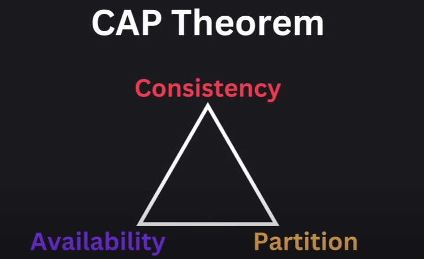

Forward Proxy - to hide clients identity
e.g. kind of VPN when server doesnt know where the client is

Reverse Proxy - to hide server identity
e.g. 1. your compnay might not want emp to visit certain website, so they will set rules in the Reverse Proxy server
2. Also do load balancing
3. also CDN are like reverse proxy CDN is content delivery network

Loading balancing have few ways in which it balances the load
1. Round Robin - when a new client is making a request it goes in the round/circle pattern to all the avaible server in the pool
2. Least Connection - Direct traffic to the serve with least active Connection
3. Leat Response time - It chooses the server with lowest response time and fewest active Connection
4. IR hash - it decides which server will requet based on the cleint IP hash in the request, 
this is imporatnt when we want to persist session in an appliacation so tehn we can make same cleint connect
same server to persist session
5. Weighted Algoritm - in this server which are more powerfuill handle more request to other, this is helfull when server in the pool
have different ram cpu etc
6. Gepgrphic Algo - request is send to the server whihc is Gepgrphically closser

FAMOUS 
H/W load balancing are - F5, citrix
S/W load balancing are - HA Proxy, Nginix (Often used as a web server, load balance, reverse proxy, etc)
Cloud based load balancing are - AWS load balancing, Micrisoft Azure load balancer, Gcloud load balancer

